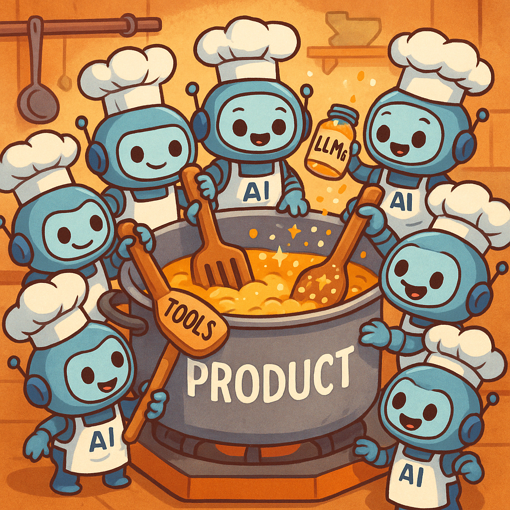

# Lightweight Agent Framework

A minimal, production-ready multi-agent orchestration framework for building AI applications without overengineering.



## Core Purpose

This library provides a lightweight framework for orchestrating multiple AI agents to work together on complex tasks. It follows these core principles:

- **Minimal**: No unnecessary abstractions or complexity
- **Non-Overengineered**: Straightforward implementation without fancy features
- **Ready to Use**: Designed for immediate practical application
- **Reusable**: Components can be easily repurposed for different tasks
- **Production Ready**: Built for real-world deployment

## Usage Patterns

The framework supports two primary patterns for multi-agent systems:

### Static Workflows

Static workflows follow a predetermined sequence of steps with specialized agents handling specific parts of a process. This approach works well for structured tasks with clear handoff points.

**Example**: The recruitment workflow in `examples/recruitment_workflow.py` demonstrates a linear process where:
- Documents are processed sequentially
- Each agent has a specific role (profile extraction, evaluation, etc.)
- The flow follows a predetermined path

### Dynamic Swarm Multi-Agent Systems

Swarm multi-agent systems allow agents to interact more fluidly, with decisions about which agent to invoke made at runtime based on context. This approach excels at handling unpredictable scenarios that require adaptive decision-making.

**Example**: The travel planning system in `examples/swarm_multi_agent_travel.py` shows how:
- Agents can call different next agents based on current conditions
- The system can handle error cases and missing information
- The flow adapts to user input and external data

## Core Components

The framework is built around these key components:

### ToolRegistry

A global registry for callable tools and their JSON schemas:
- `ToolRegistry.register()`: Registers a function as a callable tool
- `ToolRegistry.get()`: Retrieves a tool by name
- `ToolRegistry.schema()`: Gets the JSON schema for a tool

### LLM

A minimal chat model wrapper that abstracts away provider-specific implementations:
```python
llm = LLM("gpt-4o", client)  # Works with OpenAI, Claude, Mistral, etc.
response = llm.chat(messages)
```

### AgentConfig

Configuration class for agents with parameters for:
- Name and description
- LLM instance to use
- Available tools
- Allowed agents to call
- Task description

### BaseAgent

Superclass for creating agents with:
- `decide()`: Core method for agent decision-making
- `_system_prompt()`: Generates the system prompt for the agent
- Dynamic context handling for maintaining state

### Orchestrator

Manages the flow between agents:
- `start()`: Initiates the orchestration with an entry agent
- `run()`: Executes the agent workflow until completion
- Dynamic handoff between agents based on their decisions
- Loop detection to prevent infinite cycles

## Dynamic Handoff Mechanism

The framework's dynamic handoff works through a decision protocol where agents can:
1. **Respond**: Answer directly to the user
2. **Call Tool**: Execute a registered tool function
3. **Handoff**: Transfer control to another agent

This enables flexible workflows where the next step is determined at runtime based on the current context and agent decisions.

## Getting Started

See the examples directory for implementation patterns you can adapt to your own use cases.
